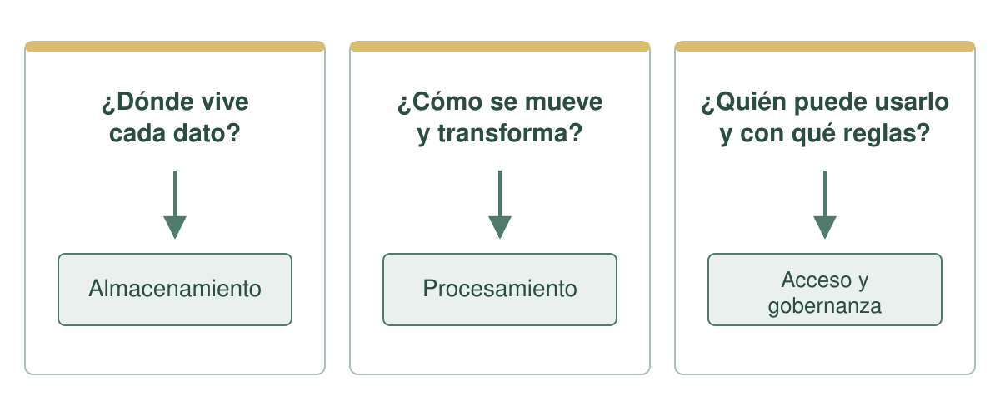
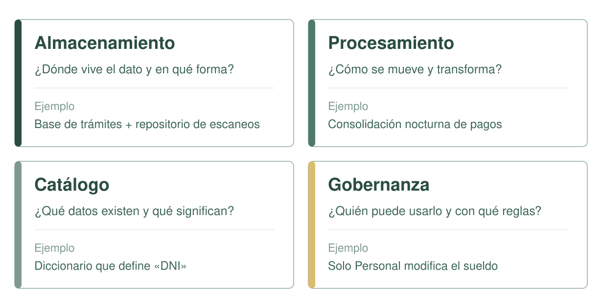
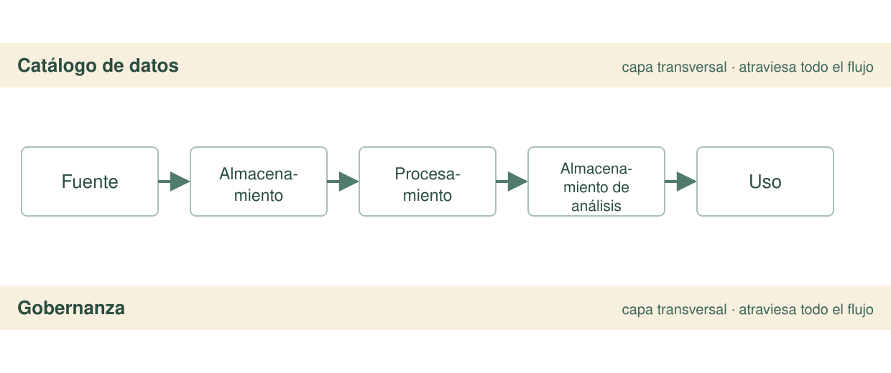
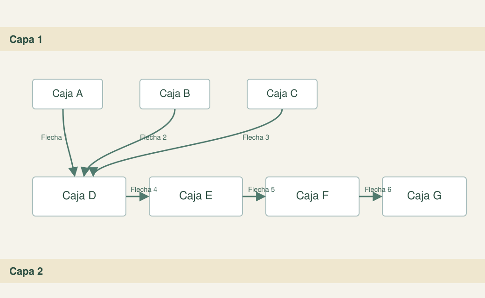
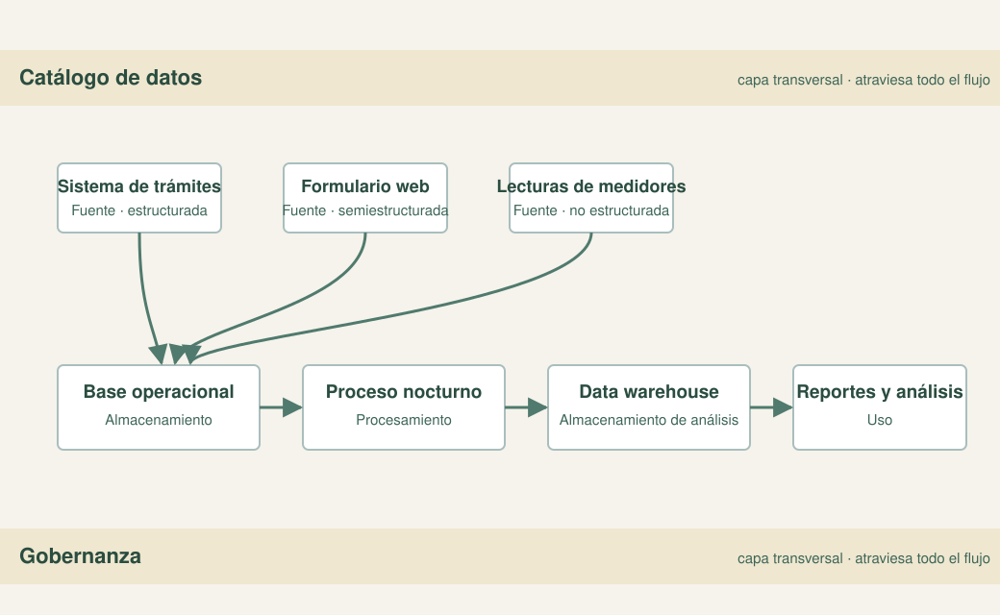

<!-- .slide: class="cover" -->

Ingeniería de Datos · IDT 601

<h1>Arquitectura de datos: conceptos y componentes</h1>

¿Cómo se organizan los datos en una plataforma?

Bloque 3 · Sesión 4 · EGPP

arquitectura =almacenar+ procesar + gobernar

Note:
- Dar la bienvenida, presentarse y ubicar la sesión: **Bloque 3 — Arquitectura de Datos**, después de los bloques de Datos e Ingesta.
- Conectar con lo ya visto: "ya sabemos de dónde salen los datos y cómo llegan; hoy: ¿cómo los organizamos para que toda la institución pueda usarlos?".
- Encuadrar al público no especialista: no hace falta saber programar, hablamos de **decisiones de diseño**.
- Anunciar la pregunta central y el recorrido: definir, entender por qué importa, conocer las piezas y practicar.
- **No olvidar:** aclarar que hay una práctica en equipos al final y que la sesión dura 180 minutos con una pausa.

---

01 / EncuadrePregunta de arranque

<h2 class="slide-title">¿Alguna vez pidieron un dato y tardaron semanas?</h2>
  
¿Recibieron el mismo dato con valores distintos según el área?

  
Anotemos 4 o 5 ejemplos en la pizarra. Los retomaremos al hablar de por qué importa el diseño.

Encuadre02

Note:
- Lanzar la pregunta y anotar 4 o 5 respuestas en la pizarra; dejarlas visibles.
- No corregir todavía: solo recolectar. Esas respuestas se retoman al hablar de silos, duplicación y desconfianza.
- Observar en voz alta el patrón común: datos dispersos, versiones que no coinciden y dependencia de personas.
- **No olvidar:** guardar la lista a la vista para recuperarla en el cierre.

---

02 / Hoja de ruta180 minutos

<h2 class="slide-title">Una sesión, seis tramos</h2>
  <table class="type-table">
    <thead><tr><th>Momento</th><th>Tiempo</th><th>Qué haremos</th></tr></thead>
    <tbody>
      <tr><td>¿Qué es?</td><td>25 min</td><td>Definición, analogía del plano y límites del concepto.</td></tr>
      <tr><td>Por qué importa</td><td>20 min</td><td>Consecuencias de diseñar (o no) la arquitectura.</td></tr>
      <tr><td>Pausa</td><td>10 min</td><td>Receso.</td></tr>
      <tr><td>Componentes</td><td>30 min</td><td>Almacenamiento, procesamiento, catálogo y gobernanza.</td></tr>
      <tr><td>Flujo y diagramas</td><td>25 min</td><td>Cómo se conectan las piezas y cómo leer un esquema.</td></tr>
      <tr><td>Práctica</td><td>50 min</td><td>Identificar componentes en un esquema sin etiquetas.</td></tr>
      <tr><td>Cierre</td><td>10 min</td><td>Síntesis y puente a la Sesión 5.</td></tr>
    </tbody>
  </table>

Hoja de ruta03

Note:
- Recorrer los tramos y fijar el contrato de tiempo.
- Ubicar la **pausa de 10 minutos** justo antes del bloque de los cuatro componentes.
- Avisar que la práctica de 50 minutos incluye la puesta en común, así que el tiempo es ajustado.
- **No olvidar:** decir que la práctica final es parte de la evaluación y que cada equipo recibirá un esquema sin etiquetas.

---

03 / ConceptoEl plano

  
<h2 class="slide-title">¿Qué es una arquitectura de datos?</h2>
El <strong>plano</strong> que define qué datos existen, dónde se guardan, cómo se mueven y quién los usa con qué reglas. <strong>No es un software</strong>: es una <strong>decisión de diseño</strong> que antecede a la tecnología.

  

<h3>Ejemplo</h3>
Dos municipios con el mismo sistema pueden tener arquitecturas muy distintas según cómo deciden organizar sus datos.

Concepto04

Note:
- Definir sin rodeos: la arquitectura es el **plano** que define qué datos existen, dónde se guardan, cómo se mueven, quién los usa y con qué reglas.
- Advertir que **no es un software**: es una **decisión de diseño** que antecede a la tecnología.
- Dar el ejemplo de dos municipios con el mismo software y arquitecturas distintas.
- **No olvidar:** remarcar que primero se decide el diseño y después se elige la tecnología, nunca al revés.

---

03 / ConceptoLa analogía

  
<h2 class="slide-title">La analogía del plano</h2>
Antes de construir una casa se dibuja un <strong>plano</strong>: dónde van las habitaciones, las cañerías y las conexiones eléctricas. La arquitectura de datos es <strong>ese plano, pero para los datos de la institución</strong>.

  

<h3>Clave</h3>
plano ≠ ladrillo

El plano <strong>no es</strong> la casa. La arquitectura <strong>no es</strong> la herramienta.

La analogía del plano05

Note:
- Insistir en la distinción: el plano no es el ladrillo; la arquitectura no es la herramienta.
- Explicar que las herramientas implementan decisiones de diseño, no las reemplazan.
- **No olvidar:** mantener visible en la pizarra "plano ≠ ladrillo".

---

04 / PreguntasTres preguntas

<h2 class="slide-title">Las tres preguntas que responde</h2>
  

Tres preguntas06

Note:
- Presentar las tres preguntas: **¿dónde vive?**, **¿cómo se mueve?**, **¿quién lo usa y con qué reglas?**.
- Mapear cada pregunta con su componente: dónde → almacenamiento; cómo → procesamiento; quién → acceso y gobernanza.
- Pedir al grupo que repita las tres preguntas en voz alta para fijarlas.
- **No olvidar:** estas preguntas son la base para identificar componentes en cualquier esquema, incluida la práctica.

---

05 / Por qué importaConsecuencias

<h2 class="slide-title">Decidir sin arquitectura tiene un costo</h2>
  <table class="type-table">
    <thead><tr><th>Consecuencia</th><th>Qué ocurre</th></tr></thead>
    <tbody>
      <tr><td>Silos</td><td>Cada área guarda "su" dato y nadie ve el conjunto.</td></tr>
      <tr><td>Duplicación</td><td>El mismo dato se captura varias veces, con valores distintos.</td></tr>
      <tr><td>Desconfianza</td><td>Cada reporte cuenta una historia distinta.</td></tr>
      <tr><td>No crece</td><td>Sumar una fuente o servicio obliga a reconstruir todo.</td></tr>
    </tbody>
  </table>
  
Diseñar es barato; reparar una arquitectura improvisada es <em>caro</em>.

Por qué importa07

Note:
- Retomar las respuestas del enganche y mostrarlas como ejemplos reales de silos, duplicación y desconfianza.
- Enfatizar que el costo de no diseñar se paga después, en decisiones lentas y proyectos que no escalan.
- **No olvidar:** vincular el "no crece" con la idea de que sumar una fuente obliga a reconstruir todo.

---

05 / Por qué importaSíntomas

<h2 class="slide-title">Cómo se reconoce una mala arquitectura</h2>
  <ol>
    <li>El <strong>mismo dato con valores distintos</strong> (padrón de contribuyentes entre Recaudaciones y Catastro).</li>
    <li>Datos <strong>encerrados</strong> en cada área.</li>
    <li>Reportes <strong>lentos o manuales</strong> (exportar y copiar en Excel durante días).</li>
    <li>Cambios <strong>traumáticos</strong> al migrar sistemas.</li>
    <li>Reglas <strong>poco claras</strong>: ¿quién es dueño del dato?</li>
  </ol>

Síntomas08

Note:
- Pedir al grupo que reconozca cuál de estos síntomas vive en su institución y lo describa en una frase.
- Detenerse en el ejemplo fuerte: el padrón de contribuyentes que no coincide entre Recaudaciones y Catastro.
- **No olvidar:** conectar "reglas poco claras" con la pregunta "¿quién es dueño del dato?", que se responde en gobernanza.

---

06 / ComponentesLas cuatro piezas

<h2 class="slide-title">Los cuatro componentes</h2>
  

Componentes09

Note:
- Presentar la grilla de las cuatro piezas: almacenamiento, procesamiento, catálogo y gobernanza.
- Recorrer cada componente con su pregunta y su ejemplo.
- Anunciar que esta es la grilla con la que se leerá cualquier arquitectura de ahora en adelante.
- **No olvidar:** dejar claro que ninguno es opcional ni intercambiable; cada uno responde una pregunta distinta.

---

06 / Componentes1 de 4

  
<h2 class="slide-title">1. Almacenamiento</h2>
Responde <strong>¿dónde vive el dato y en qué forma?</strong> Bases de datos, data warehouse, data lake y archivos. Guarda datos <strong>estructurados</strong> (tablas) y <strong>no estructurados</strong> (documentos, imágenes).

  

<h3>Ejemplo</h3>
Base de datos de trámites + repositorio de documentos escaneados del municipio.

Almacenamiento10

Note:
- Definir el almacenamiento como la respuesta a **¿dónde vive el dato y en qué forma?**.
- Nombrar los tipos: bases de datos, data warehouse, data lake y archivos.
- Distinguir el almacenamiento operacional (el día a día) del de análisis (donde se consolida para consultar).
- **No olvidar:** usar el ejemplo local de la base de trámites junto al repositorio de escaneos.

---

06 / Componentes2 de 4

  
<h2 class="slide-title">2. Procesamiento</h2>
Responde <strong>¿cómo se mueven y transforman los datos?</strong> Limpieza, unión y cálculo de indicadores, por <strong>lotes</strong> (batch, cada noche) o en <strong>tiempo real</strong> (streaming).

  

<h3>Ejemplo</h3>
recaudación · cada noche

Cada noche se consolidan los pagos del día para actualizar el reporte de recaudación.

Procesamiento11

Note:
- Explicar que el procesamiento convierte datos crudos en datos utilizables: es la "cocina" que prepara el dato.
- Presentar las dos velocidades: por lotes (batch) y en tiempo real (streaming).
- **No olvidar:** aclarar que procesar no es guardar ni mover por mover; el objetivo es que el dato quede listo.

---

06 / Componentes3 de 4

  
<h2 class="slide-title">3. Catálogo de datos</h2>
Responde <strong>¿qué datos existen y qué significan?</strong> Documenta cada dato: definición, formato, dueño y origen. Incluye <strong>metadatos</strong> (diccionario de datos).

  

<h3>Ejemplo</h3>
Un diccionario que define "DNI" como el número de identificación oficial, con su formato y el área responsable.

Catálogo12

Note:
- Definir el catálogo como la respuesta a **¿qué datos existen y qué significan?**.
- Introducir el término **metadatos** y su forma más conocida: el diccionario de datos.
- **No olvidar:** sin catálogo nadie sabe qué significa cada campo; es lo que permite que dos áreas hablen del mismo dato con el mismo nombre.

---

06 / Componentes4 de 4

  
<h2 class="slide-title">4. Gobernanza</h2>
Responde <strong>¿quién puede usarlo y con qué reglas?</strong> Calidad, seguridad, privacidad, responsabilidad y acceso. Define <strong>dueños del dato</strong> y condiciones de uso.

  

<h3>Ejemplo</h3>
Solo el área de personal modifica el sueldo registrado; acceder a datos personales exige autorización.

Gobernanza13

Note:
- Definir la gobernanza como la respuesta a **¿quién puede usarlo y con qué reglas?**.
- Enumerar lo que cubre: calidad, seguridad, privacidad, responsabilidad y acceso.
- **No olvidar:** remarcar que la gobernanza no es burocracia; es lo que hace que el dato sea confiable y seguro.

---

07 / FlujoCómo se conectan

<h2 class="slide-title">El flujo entre componentes</h2>
  
  
El catálogo y la gobernanza <em>no son una etapa</em>: atraviesan todo el flujo.

Flujo14

Note:
- Dibujar el flujo completo: Fuente → Almacenamiento → Procesamiento → Almacenamiento de análisis → Uso.
- Señalar la idea central: el catálogo y la gobernanza son **capas transversales**, no una caja más del flujo.
- Aclarar el error frecuente de dibujarlos como un paso adicional.
- **No olvidar:** repetir que todo el trayecto está documentado (catálogo) y regulado (gobernanza).

---

08 / LecturaCinco preguntas

  
<h2 class="slide-title">Cómo leer un diagrama</h2>
    <table class="type-table">
      <thead><tr><th>Pregunta</th><th>Componente</th></tr></thead>
      <tbody>
        <tr><td>¿Dónde nacen los datos?</td><td>Fuentes</td></tr>
        <tr><td>¿Dónde se guardan?</td><td>Almacenamiento</td></tr>
        <tr><td>¿Qué los transforma?</td><td>Procesamiento</td></tr>
        <tr><td>¿Dónde está su definición?</td><td>Catálogo</td></tr>
        <tr><td>¿Quién controla el acceso?</td><td>Gobernanza</td></tr>
      </tbody>
    </table>
  

  

Leer un diagrama15

Note:
- Presentar el procedimiento de cinco preguntas y responderlas en voz alta junto con el grupo sobre el esquema de la derecha.
- Señalar que no hace falta saber tecnología: basta con responder las cinco preguntas para entender un diagrama.
- **No olvidar:** este slide es el puente hacia la práctica; no pasar de largo sin leer un diagrama en conjunto.

---

08 / LecturaLa solución

<h2 class="slide-title">Así se lee el mismo esquema, resuelto</h2>
  

Solución16

Note:
- Recorrer el esquema resuelto y contrastarlo con las respuestas del grupo.
- Reforzar la distinción almacenamiento ≠ procesamiento y las capas transversales.
- **No olvidar:** aclarar que un mismo esquema admite matices, pero los roles de cada caja son los mismos.

---

09 / PrácticaIdentificar componentes

<h2 class="slide-title">Práctica: identificar componentes</h2>
  

    <article class="card"><h3>1. En equipos de 3–4</h3>
Reciban un esquema sin etiquetas.
</article>
    <article class="card"><h3>2. Etiqueten y justifiquen</h3>
Cada caja, con su componente y una razón.
</article>
    <article class="card"><h3>3. Describan el flujo</h3>
De la fuente al uso, con las capas transversales.
</article>
  

  
Puesta en común: cada equipo expone <strong>un componente y su justificación</strong>. Entrega: hoja de trabajo con el esquema etiquetado.

Práctica17

Note:
- Dar la consigna: equipos de 3 a 4 personas, esquema sin etiquetas y hoja con las cuatro categorías.
- Recordar los tres pasos y el tiempo: 50 minutos en total, incluida la puesta en común.
- Circular entre los equipos para destrabar dudas y orientar la lectura del esquema.
- **No olvidar:** valorar que distingan almacenamiento de procesamiento y que reconozcan catálogo y gobernanza como capas transversales.

---

10 / En resumenCierre

<h2 class="slide-title">La arquitectura es el plano de la información</h2>
  

    <article class="card"><h3>Qué es</h3>
El plano de qué datos existen, dónde se guardan y quién los usa. No es la herramienta.
</article>
    <article class="card"><h3>Componentes</h3>
Almacenamiento, procesamiento, catálogo y gobernanza.
</article>
    <article class="card"><h3>Flujo</h3>
De la fuente al uso, con catálogo y gobernanza como capas transversales.
</article>
  

  
Próxima sesión: los <em>patrones de arquitectura</em> — warehouse, lake, lakehouse y lambda.

Fin de la sesión18

Note:
- Sintetizar las tres ideas: la arquitectura es el plano; cuatro componentes; un flujo con capas transversales.
- Releer la frase de la pizarra: dónde / cómo / qué es / quién.
- Anticipar la Sesión 5: los patrones de arquitectura, también con práctica.
- **No olvidar:** recordar la entrega (hoja de trabajo con el esquema etiquetado y el flujo).

---

<!-- .slide: class="dark" -->

FinIngeniería de Datos · IDT 601

  <h2 class="slide-title">Gracias</h2>
  
Bloque 3 · Sesión 4 · Arquitectura de datos

  
La próxima sesión: patrones de arquitectura y diseño.

EGPP · Escuela de Gestión Pública Plurinacional19

Note:
- Agradecer la participación y abrir el espacio de preguntas y dudas.
- Recordar la entrega pendiente y el material de la Sesión 5.
- Cerrar con el puente: la próxima sesión sigue en el Bloque 3 con los patrones de arquitectura y diseño.
- **No olvidar:** quedarse disponible para consultas y confirmar el canal de contacto del curso.
